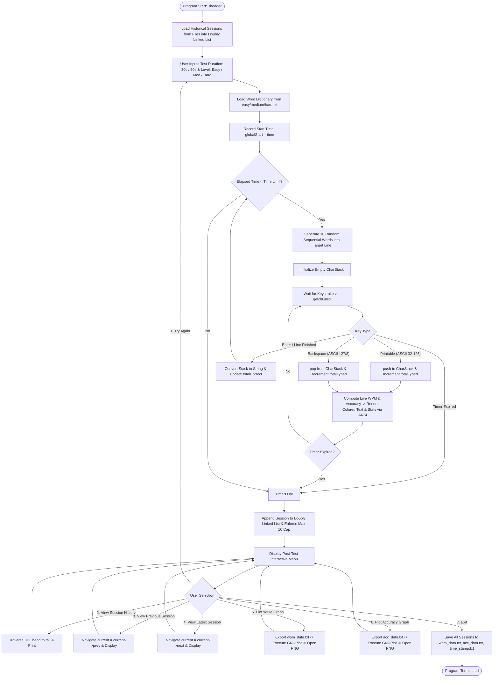

# Project Architecture, Flow & Tech Stack Documentation
# Terminal-Based Typing Speed Tester (DSA Mini-Project)

---

## 1. Executive Summary

The **Typing Speed Tester** is an interactive, terminal-based application written in **C** for Linux/POSIX environments. It assesses user typing speed (Words Per Minute - WPM) and accuracy in real-time. The project demonstrates practical applications of fundamental Data Structures and Algorithms (DSA)—including **Stacks**, **Doubly Linked Lists**, **Arrays**, and **File I/O Streams**—combined with low-level POSIX terminal control and external data visualization via **GNUPlot**.

---

## 2. Tech Stack

| Layer / Domain | Technology / Tool | Purpose & Implementation Details |
| :--- | :--- | :--- |
| **Core Language** | **C (C99 / C11)** | High-performance system-level implementation and memory management. |
| **Compiler & Toolchain** | **GCC (GNU Compiler Collection)** | Compilation with POSIX math library linkage (`-lm`). |
| **Operating System** | **Linux / Ubuntu / WSL** | Native POSIX API support for terminal I/O and process execution. |
| **Terminal I/O Control** | `termios.h`, `unistd.h` | Low-level terminal mode manipulation: switches terminal from Canonical/Echo mode to raw unbuffered non-canonical mode (`ICANON`, `ECHO` flags disabled) for real-time key-by-key capture without requiring `<Enter>`. |
| **Visual Formatting** | **ANSI Escape Codes** | In-place terminal re-rendering, cursor repositioning (`\033[nA`, `\033[nC`, `\033[nD`), line clearing (`\033[2K`), and color formatting (`\033[32m` for Green, `\033[31m` for Red, `\033[0m` for Reset). |
| **Data Structures** | **Stack (LIFO)** | Fixed-size array stack (`CharStack`) managing active typed line characters, pushing keystrokes and popping on Backspace. |
| | **Doubly Linked List (DLL)** | Bidirectional dynamic linked list (`Session`) managing a sliding window of the last 10 typing sessions with bidirectional navigation. |
| | **Arrays & Strings** | 2D character arrays (`words[500][25]`, `selected[10][25]`) for dictionary handling and sentence construction. |
| **Data Persistence** | **C Standard File I/O (`stdio.h`)** | Reading word banks (`easy.txt`, `medium.txt`, `hard.txt`), persisting session history (`wpm_data.txt`, `acc_data.txt`, `time_stamp.txt`), and graph sequence counter (`graph_no.txt`). |
| **Data Visualization** | **GNUPlot** | Generates standalone graphical trend charts (`.png`) for WPM and Accuracy vs. Session Number via automated script generation (`plot_script.gp`, `plot_acc_script.gp`). |
| **System Utilities** | `xdg-open` / `system()` | Spawns background viewer processes to display generated PNG graph artifacts. |
| **Time & Randomness** | `time.h`, `stdlib.h` | Real-time elapsed time tracking (`time()`, `difftime()`), formatted timestamps (`strftime()`), and pseudo-random paragraph chunk generation (`srand()`, `rand()`). |

---

## 3. Project File Structure & Module Map

```
Dsa_mini-project_typing-speed-tester/
│
├── header.c              # Main Driver: orchestrates setup, game loop, real-time metrics & post-session menu
├── stack_module.c        # Stack Module: CharStack operations (init, push, pop, toString) & WPM/Accuracy logic
├── doublyll_module.c     # Doubly Linked List: session history (add, remove oldest, navigate, plot graphs)
├── file_module.c         # File & Word Module: loads dictionaries, generates random start indices & 10-word lines
├── terminal_module.c     # Terminal Module: raw getchLinux() input, ANSI cursor movement & colored printing
│
├── easy.txt              # Word Bank for Easy difficulty level
├── medium.txt            # Word Bank for Medium difficulty level
├── hard.txt              # Word Bank for Hard difficulty level
│
├── wpm_data.txt          # Persistent record of Session ID vs WPM
├── acc_data.txt          # Persistent record of Session ID vs Accuracy
├── time_stamp.txt        # Persistent record of Session ID vs Date/Time
├── graph_no.txt          # Counter file for incremental PNG graph image filenames
│
├── plot_script.gp        # Auto-generated GNUPlot script for WPM progress plotting
├── plot_acc_script.gp    # Auto-generated GNUPlot script for Accuracy progress plotting
│
├── README.md             # High-level project documentation
└── flow.md               # Detailed technical flow and architecture specification
```

---

## 4. End-to-End Execution Flow

### 4.1 Master Flowchart



---

## 5. Detailed Phase-by-Phase Technical Walkthrough

### Phase 1: Initialization & Session Restoration
1. `main()` initiates `load_sessions_from_files()` in [doublyll_module.c](file:///home/vaibhav-chavan/github-trial/Dsa_mini-project_typing-speed-tester/doublyll_module.c#L272-L334).
2. The function opens `wpm_data.txt`, `acc_data.txt`, and `time_stamp.txt` in parallel.
3. For each recorded entry, dynamic memory is allocated (`malloc(sizeof(Session))`) and linked sequentially into a **Doubly Linked List** (`head`, `tail`).
4. `globalSessionID` is synchronized with the latest session ID found in storage.

### Phase 2: Configuration & Dictionary Ingestion
1. The user selects:
   - **Duration**: `30` or `60` seconds.
   - **Difficulty Level**: `1` (Easy: `easy.txt`), `2` (Medium: `medium.txt`), or `3` (Hard: `hard.txt`).
2. `load_words_from_file(level, words)` reads up to 500 space-delimited words into the 2D matrix `words[500][25]` in [file_module.c](file:///home/vaibhav-chavan/github-trial/Dsa_mini-project_typing-speed-tester/file_module.c#L13-L38).
3. The global session timer `globalStart = time(NULL)` is locked.

### Phase 3: Active Real-time Typing Engine
The outer loop runs while `difftime(time(NULL), globalStart) < timeLimit`:
1. **Line Generation**:
   - `GenerateStartIndex(&startIndex)` calculates a pseudo-random start index (in steps of 10) while tracking a `visited[]` array to prevent immediate repeats.
   - `get_next_10_words()` extracts 10 consecutive words into `selected[10][25]`.
   - `create_line()` concatenates the selected words into a single target string separated by spaces.
2. **Stack Lifecycle**:
   - `initStack(&stack)` initializes `top = -1`.
   - Raw terminal mode `getchLinux()` captures input without line buffering or terminal echoing.
3. **Keystroke Processing & LIFO Operations**:
   - **Char Insertion**: `push(&stack, ch)` pushes char onto array, increments counters.
   - **Backspace / Delete**: `pop(&stack)` removes the top character, decrements `totalTyped` and `curr_typed_line`.
   - **Line Completion / Enter**: `toString(&stack, typed_temp)` extracts the stack string, passes it to `update()` to tally matching characters into `totalCorrect`, and advances to the next sentence.
4. **Live Visual Feedback & ANSI Manipulation**:
   - `calculateAccuracy()` and `computeWPM()` compute real-time scores.
   - `clearLine()` (`\033[2K`) wipes the current terminal line.
   - `printColoredTyped()` iterates through the typed buffer: characters matching target index are printed in **Green** (`\033[32m`), mismatches in **Red** (`\033[31m`).
   - Live metrics `Accuracy: %.2f%% | WPM: %d` are re-printed and the cursor is repositioned directly at the typing head using `moveCursorUp()` and `moveCursorRight()`.

### Phase 4: Session Finalization & DLL Storage
1. When `difftime` exceeds `timeLimit`, the loop terminates.
2. `add_session(wpm, accuracy)` in [doublyll_module.c](file:///home/vaibhav-chavan/github-trial/Dsa_mini-project_typing-speed-tester/doublyll_module.c#L70-L88):
   - Generates a local timestamp string (`YYYY-MM-DD HH:MM:SS`) using `strftime()`.
   - Allocates a new `Session` node with incremental `sessionID`.
   - Appends node to the tail of the Doubly Linked List.
   - **Sliding Window Maintenance**: If `sessionCount > 10`, `remove_oldest()` detaches `head`, shifts node IDs, and frees memory (`free(tmp)`).
   - Sets navigation pointer `current = tail`.

### Phase 5: Post-Session Interactive Menu & Visualization
Users can perform the following actions:
- **`1. Try Again`**: Restarts the typing cycle with fresh configurations.
- **`2. View session history`**: Iterates from `head` to `tail`, outputting all stored sessions with their WPM, accuracy, and timestamp.
- **`3. View previous session`**: Traverses backward (`current = current->prev`) and prints that specific session.
- **`4. View latest session`**: Traverses forward (`current = current->next`) and prints that specific session.
- **`5. Plot WPM graph`**:
  - Dumps DLL data points `(session_index, wpm)` into `wpm_data.txt`.
  - Dynamically builds GNUPlot script `plot_script.gp`.
  - Executes `system("gnuplot plot_script.gp")` to render `wpm_graph_<id>.png`.
  - Opens image asynchronously using `system("xdg-open wpm_graph_<id>.png &")`.
- **`6. Plot Accuracy graph`**:
  - Dumps DLL data points `(session_index, accuracy)` into `acc_data.txt`.
  - Dynamically builds GNUPlot script `plot_acc_script.gp`.
  - Executes `system("gnuplot plot_acc_script.gp")` to render `acc_graph_<id>.png` (scaled 0-100%).
  - Opens image asynchronously using `system("xdg-open acc_graph_<id>.png &")`.
- **`7. Exit`**: Calls `save_text_files()` to persist all DLL session nodes to disk and exits cleanly.

---

## 6. Mathematical Formulas & Metric Calculations

### 6.1 Words Per Minute (WPM)
Standard typing formula based on 5 characters per standard word:
$$\text{WPM} = \text{round}\left( \frac{\frac{\text{totalTyped}}{5.0}}{\frac{\text{elapsedSeconds}}{60.0}} \right)$$

### 6.2 Accuracy Percentage
Calculated as the ratio of correctly typed characters to total characters typed:
$$\text{Accuracy (\%)} = \left( \frac{\text{totalCorrect}}{\text{totalTyped}} \right) \times 100$$

---

## 7. Data Structure Design

### 7.1 Character Stack (`CharStack`)
```c
typedef struct {
    char arr[MAX_CHARS]; // Fixed buffer (1000 characters)
    int top;             // Index of top element (-1 when empty)
} CharStack;
```
- **Time Complexity**:
  - `push()`: $\mathcal{O}(1)$
  - `pop()`: $\mathcal{O}(1)$
  - `toString()`: $\mathcal{O}(N)$ where $N$ is typed line length

### 7.2 Doubly Linked List Node (`Session`)
```c
typedef struct Session {
    int sessionID;
    double wpm;
    double accuracy;
    char timestamp[50];
    struct Session *prev; // Pointer to preceding session
    struct Session *next; // Pointer to subsequent session
} Session;
```
- **Time Complexity**:
  - `add_session()`: $\mathcal{O}(1)$ (insertion at `tail`)
  - `remove_oldest()`: $\mathcal{O}(K)$ (removal at `head` where $K \le 10$)
  - `displayPrevSession()` / `displayNextSession()`: $\mathcal{O}(1)$ pointer navigation

---

## 8. Compilation and Execution Guide

### Prerequisites
- **GCC Compiler**
- **GNUPlot** (`sudo apt install gnuplot`)
- **xdg-utils** (for `xdg-open` preview on desktop Linux)

### Build Command
```bash
gcc header.c -o header -lm
```

### Run Command
```bash
./header
```
